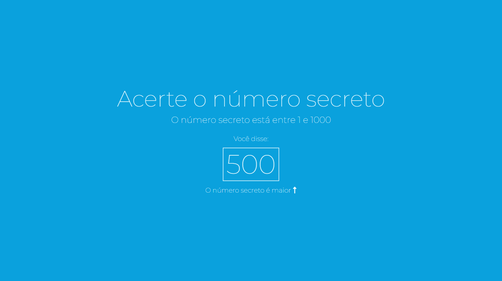

# Jogo Número Secreto

> Jogo Número Secreto

Projeto construído durante o curso JavaScript: validações e reconhecimento de voz, ministrado pela Alura.

[Clique aqui para acessar](https://paulomarquesdev.github.io/jogo-numero-secreto/)

## Tecnologias

- HTML e CSS
- JavaScript

## 💻 Projeto

O Jogo Número Secreto é um jogo, onde o objetivo é adivinhar o número secreto falando chutes de números, a cada novo chute o jogo informa se o número secreto é maior ou menor, isso se repete até que você acerte o número. A página foi desenvolvida aplicando JavaScript para criar a mecânica do jogo.
